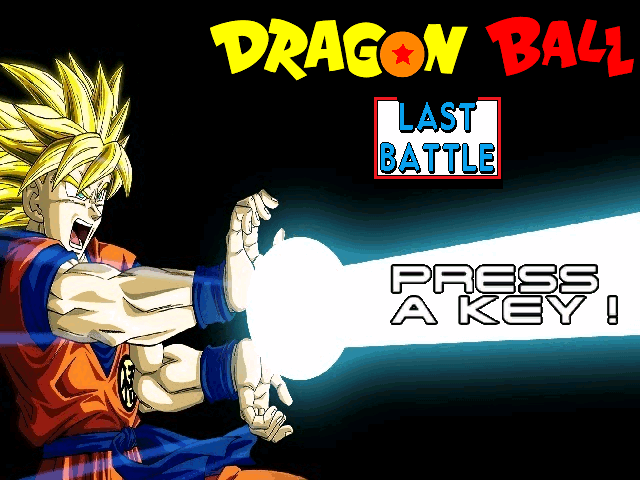
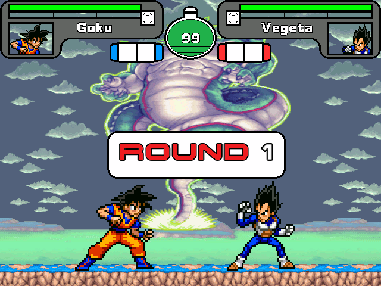

## Captures d'écran / Screenshots

 


## FR :fr:


Pour ce projet personnel, j'ai voulu créer un jeu de versus fighting sur l'univers du célèbre manga Dragon Ball d'Akira Toriyama.
J'ai intitulé ce projet sous le nom de **Dragon Ball - Last Battle**.

Il a été réalisé avec le moteur de jeu suivant :

* M.U.G.E.N by Elecbyte

#### Installation Windows

Pour pouvoir essayer le jeu, merci de le [télécharger](https://github.com/SuijoART/Dragon-Ball-Last-Battle/releases/tag/v1.0) et de l'extraire. 

Merci de lire le fichier **Help.pdf** avant de commencer à jouer.

#### Installation GNU/Linux

Suivez les instructions d'installation Windows.
Après cela, télécharger le logiciel [Wine](https://wiki.winehq.org/Download) pour pouvoir exécuter des fichiers **.exe**. 

Enfin, pour lancer le jeu, exécuté dans le terminal (Déplacer vous à la racine du dossier du jeu) :

```console
wine Dragon\ Ball\ -\ Last\ Battle.exe
```

## EN :us:

For this personal project, I wanted to create a versus fighting game on the universe of the famous manga Dragon Ball by Akira Toriyama.
I titled this project as **Dragon Ball - Last Battle**.

It was realized with the following game engine :

* M.U.G.E.N by Elecbyte

#### Windows installation

In order to try the game, please [download](https://github.com/SuijoART/Dragon-Ball-Last-Battle/releases/tag/v1.0) and extract it. 

Please read the **Help.pdf** file before you start playing.

#### GNU/Linux installation

Follow the Windows installation instructions.
After that, download the [Wine](https://wiki.winehq.org/Download) software to be able to run **.exe** files.

Finally, to lauch the game executed in the terminal (move to the root of the game folder) :

```console
wine Dragon\ Ball\ -\ Last\ Battle.exe
```
